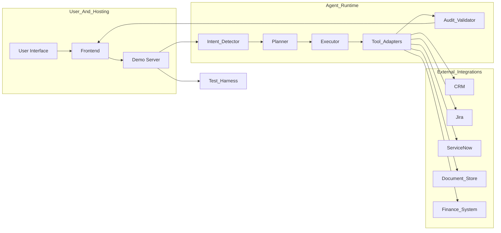
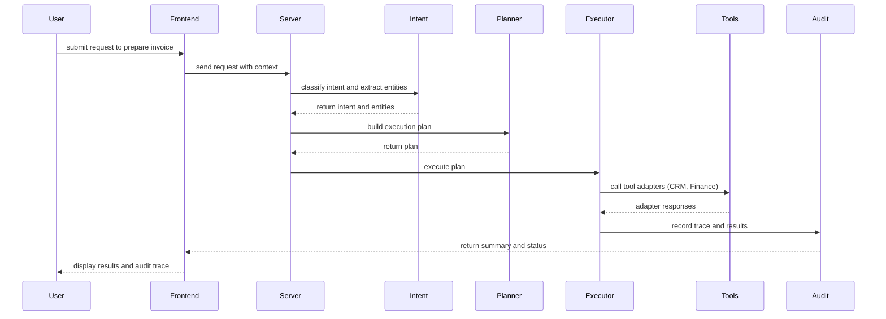

# Client Flow — Agentic Customer Intelligence

  

A demonstration-grade Agentic AI platform that proactively understands customer intent, plans actions, and executes integrations across CRM, project and service workflows. This repository contains a compact full‑stack demo (React + Vite frontend, Node server) showcasing intent extraction, planning, tool orchestration and verification — designed to impress technical reviewers and recruiters by showing production‑approachable design, test coverage and clear observability.

If you want to discuss this project or request access, email: yuvanchaudary2004@gmail.com

---

## Why this project matters (recruiter elevator)

Client Flow demonstrates how agentic architectures can transform customer operations: instead of reactive tickets or manual lookups, an assistant anticipates needs, gathers context, and performs high‑value actions (create ticket, prepare invoice draft, surface documents) with audit trails. It showcases:

- Real integrations (CRM, Jira, ServiceNow, finance tools) and tool adapters.
- Clear separation of responsibilities: Intent → Plan → Execute → Validate → Audit.
- Testable agent logic (unit and E2E tests included) and demonstration UI to showcase flow to stakeholders.

---

## Highlights

- Agent Core: intent detection, planner, executor and validators (server/agents)
- Tooling Adapters: CRM, Jira, ServiceNow, Document & Finance connectors (server/tools)
- Frontend: React components for assistant, dashboard, verification and analytics (src/components)
- Tests: unit & E2E test suite (server/tests) with example scenarios
- Lightweight server: single-file demonstration server.ts for quick local demos

---

## Architecture — high level

Below is a simplified architecture diagram. (Note: diagram uses GitHub-friendly Mermaid identifiers and plain labels to ensure rendering.)

Notes
- Planner composes ordered steps; Executor runs them and the Audit component records an execution trace for observability and debugging.
- Tool adapters encapsulate external API specifics and the demo includes mocked connectors for safe local demos.

---

## User Flow (detailed)

This user flow is ideal to walk a recruiter through in a live demo or recorded GIF.

1. User opens the assistant UI and types a request (e.g., prepare customer invoice).
2. Frontend sends the request to the demo gateway with contextual metadata.
3. Server runs intent classification and entity extraction.
4. Planner generates a deterministic plan (sequence of steps) to satisfy the intent.
5. Executor runs steps using Tool Adapters; each action is validated and recorded.
6. Audit stores the execution trace and result summaries.
7. Frontend displays the plan, step-by-step execution progress and final advisory.

Sequence diagram (plain labels for compatibility)

---

## Project structure (explicit)

Top-level layout (key folders and purpose):

- server/                 — Agent runtime, agents, adapters and test harness
  - agents/               — intent, planner, executor, validator, audit
  - tools/                — connectors: crm.ts, jira.ts, servicenow.ts, finance.ts, documents.ts
  - tests/                — unit & E2E tests for planner, intent, integrations
  - server.ts             — demo gateway and minimal server runner
- src/                    — React frontend (AIAssistant, Dashboard, VerificationHub, etc.)
- docs/                   — architecture.md and supporting design notes
- package.json            — npm scripts (dev, build, test)
- vite.config.ts          — frontend config for Vite
- .env.example            — template env file for local keys (do not commit secrets)

Use this map in a recruiter demo to point attention quickly to the planner, executor and audit folders.

---

## Setup & Quickstart (developer friendly)

Requirements
- Node 18+ and npm
- Git

Local dev (frontend + server)

1. Clone

   git clone https://github.com/YuvanChaudary/client_flow.git
   cd client_flow

2. Install

   npm install

3. Run dev server + UI

   # Start frontend dev server
   npm run dev

   # In another terminal, start the demo gateway
   node server.ts

4. Run tests

   npm test

Notes for demo
- Use the sample scenarios in src/initialData.ts to trigger rich planner outputs quickly.
- Open server logs to show execution traces and the audit output for transparency.

---

## Verification & demo checklist (what to show to a recruiter)

- Launch the UI and trigger a sample flow: show the planner’s generated steps and the audit trace.
- Run unit tests (server/tests) to demonstrate code quality and test coverage.
- Open docs/architecture.md and walk through component responsibilities.
- Show the mock integrations (CRM/Jira) and how the executor composes actions.
- Explain safety: validators prevent unsafe actions and every execution produces an auditable record.

Suggested talking points
- Separation of concerns and testability
- How planners translate ambiguous user requests to deterministic plans
- Observability: audit trails, test harness outputs and error handling

---

## How to impress further (recommended additions)

- Add CI with badge (GitHub Actions) to show build/tests passing.
- Record a short demo GIF and embed it at the top of the README.
- Add a short case study in docs/ showing a real scenario and metrics (time saved, actions automated).

---

## Contact

For access or a live walkthrough: yuvanchaudary2004@gmail.com

If you want, I can now:
- Render the diagrams to SVG and add them under docs/ for guaranteed visual presentation on GitHub.
- Add CI badges and a short demo GIF (I can pull screenshots / create a short recording if you provide one).

