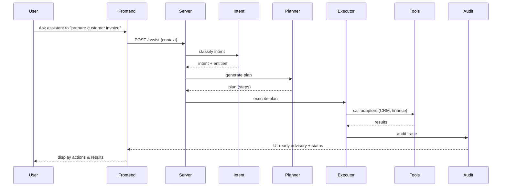

# Client Flow — Agentic Customer Intelligence

[](https://client-flow-one-iota.vercel.app/) [](#) [](#)

A demonstration-grade Agentic AI platform that proactively understands customer intent, plans actions, and executes integrations across CRM, project and service workflows. This repository contains a compact full‑stack demo (React + Vite frontend, Node server) showcasing intent extraction, planning, tool orchestration and verification — designed to impress technical reviewers and recruiters by showing production‑approachable design, test coverage and clear observability.

If you want to discuss this project or request access, email: yuvanchaudary2004@gmail.com

---

## Why this project matters (recruiter elevator)

Client Flow demonstrates how agentic architectures can transform customer operations: instead of reactive tickets or manual lookups, an assistant anticipates needs, gathers context, and performs high‑value actions (create ticket, prepare invoice draft, surface documents) with audit trails. It showcases:

- Real integrations (CRM, Jira, ServiceNow, finance tools) and tool adapters.
- Clear separation of responsibilities: Intent → Plan → Execute → Validate → Audit.
- Testable agent logic (unit and E2E tests included) and demonstration UI to showcase flow to stakeholders.

---

## Highlights

- Agent Core: intent detection, planner, executor and validators (server/agents)
- Tooling Adapters: CRM, Jira, ServiceNow, Document & Finance connectors (server/tools)
- Frontend: React components for assistant, dashboard, verification and analytics (src/components)
- Tests: unit & E2E test suite (server/tests) with example scenarios
- Lightweight server: single-file demonstration server.ts for quick local demos

---

## Architecture — high level

```mermaid
flowchart LR
  subgraph ONPREM_CLOUD["User & Hosting"]
    U[User / Agent Interface] -->|UI / API| FE[Frontend (React)]
    FE -->|HTTP / WS| API[Gateway / Demo Server]
  end

  subgraph AGENT["Agent Runtime"]
    API --> Intent[Intent Detector]
    Intent --> Planner[Planner]
    Planner --> Executor[Executor / Orchestrator]
    Executor --> Tools[Tool Adapters]
    Tools --> Audit[Audit & Validator]
    Audit --> FE
  end

  subgraph TOOLS["External Integrations"]
    Tools --> CRM[CRM]
    Tools --> Jira[Jira]
    Tools --> SN[ServiceNow]
    Tools --> Docs[Document Store]
    Tools --> Finance[Finance System]
  end

  API --> Tests[Test Harness]
```

Notes
- The Planner composes a sequence of tool actions; the Executor runs them with validators and produces an auditable trace saved by the Audit component.
- Tool adapters are intentionally thin: they encapsulate API specifics and mocking for the demo/test harness.

---

## User → System Flow (sequence)



---

## Project structure (key files)

- server/
  - agents/        — intent, planner, executor, validator, audit
  - tools/         — CRM, Jira, ServiceNow, docs, finance adapters
  - tests/         — unit & E2E tests (planner, intent, integrations)
  - server.ts      — demo gateway / server runner
- src/             — React UI and components (AIAssistant, Dashboard, VerificationHub)
- docs/            — architecture notes and supporting materials
- package.json     — build & dev scripts
- vite.config.ts   — frontend config

For full tree, review repository files or open docs/architecture.md for diagrams and rationale.

---

## Setup & Quickstart (developer friendly)

Requirements
- Node 18+ and npm
- Git

Local dev (frontend + server)

1. Clone

   git clone https://github.com/YuvanChaudary/client_flow.git
   cd client_flow

2. Install

   npm install

3. Run dev server + UI

   # Start frontend dev server
   npm run dev

   # In another terminal, start the demo gateway (if you want the server runner)
   node server.ts

4. Run tests

   npm test

Notes
- For a recruiter demo: run the frontend, open AIAssistant and use the example scenarios in src/initialData.ts to showcase flows quickly.

---

## Verification & demo checklist (what to show to a recruiter)

- Launch the UI and trigger a sample flow: show the planner’s generated steps and the audit trace.
- Run unit tests (server/tests) to demonstrate code quality and test coverage.
- Open docs/architecture.md and walk through the component responsibilities.
- Show the mock integrations (CRM/Jira) and how the executor composes actions.
- Explain safety: validators prevent unsafe actions and every execution produces an auditable record.

Suggested talking points
- Separation of concerns and testability
- How planners translate ambiguous user requests to deterministic plans
- Observability: audit trails, test harness outputs and error handling

---

## How to impress further (recommended additions)

- Add CI with badge (GitHub Actions) to show build/tests passing.
- Record a 60–90s demo video GIF and embed it at the top of the README.
- Add a short case study in docs/ showing a real scenario and metrics (time saved, actions automated).

---

## Contact

For access or a live walkthrough: yuvanchaudary2004@gmail.com

If you want, I can now:
- Render the diagrams to SVG and add them under docs/ for guaranteed visual presentation on GitHub.
- Add CI badges and a short demo GIF (I can pull screenshots / create a short recording if you provide one).

